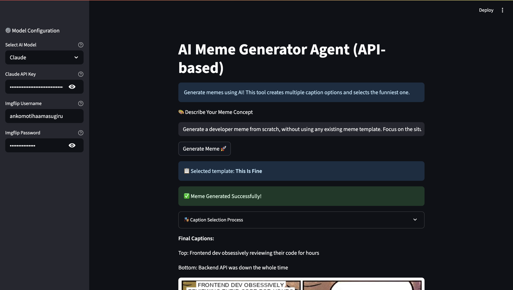

# AI Meme Generator with LangGraph

[](https://github.com/KikuchiSayaka/ai_meme_generator_agent_api)
[](https://www.python.org/downloads/)
[](https://github.com/langchain-ai/langchain)
[](https://opensource.org/licenses/Apache-2.0)

<p align="center">
  
  
  
  
</p>

> An intelligent meme generator powered by **Streamlit**, **LangChain**, and **LangGraph** that creates multiple caption options and uses AI to select the funniest one!

<div align="center">
  
</div>

## What Makes This Special?

This project showcases the power of modern AI orchestration:

- ** LangChain** for LLM interactions
- ** LangGraph** for complex multi-step workflows
- ** Streamlit** for instant web deployment
- ** Multi-LLM support** (Claude 3.5 & GPT-3.5)

## Key Features

### **Smart Caption Generation**

- Generates **2 different caption variations** for each meme
- AI evaluates and selects the funniest option
- Shows the selection process and reasoning transparently

### **Focused Template Selection**

- Uses only standard 2-box meme templates (top/bottom text)
- AI selects the most appropriate template for your idea
- Works with 30+ popular meme formats

### **Multi-LLM Support**

- **Claude 3.5 Sonnet** (Anthropic) - Recommended for best results
- **GPT-3.5 Turbo** (OpenAI) - Fast and cost-effective
- Easy to extend with other models

### **LangGraph Workflow**

- Orchestrated multi-step process:
  1. Template selection
  2. Multiple caption generation
  3. AI-based humor evaluation
  4. Final meme creation
- Clean separation of concerns with state management

### **User Interface**

- Built with Streamlit for easy interaction
- Live preview of generated memes
- Expandable view to see caption selection process
- Simple API key management

## 🔧 Required API Keys

1. **[OpenAI](https://platform.openai.com/account/api-keys)** or **[Anthropic](https://console.anthropic.com/settings/keys)**
   - For AI-powered caption generation and selection
2. **[Imgflip](https://imgflip.com/api)**
   - Free account required
   - Uses official API (no scraping)

## Quick Start

1. **Clone the repository**

   ```bash
   git clone https://github.com/KikuchiSayaka/ai_meme_generator_agent_api.git
   cd ai_meme_generator_agent_api
   ```

2. **Install dependencies**

   ```bash
   pip install -r requirements.txt
   ```

3. **Set up environment variables** (optional)

   Create a `.env` file in the project root:

   ```
   OPENAI_API_KEY=your-openai-key-here
   ANTHROPIC_API_KEY=your-anthropic-key-here
   IMGFLIP_USERNAME=your-imgflip-username
   IMGFLIP_PASSWORD=your-imgflip-password
   ```

4. **Run the application**

   ```bash
   streamlit run ai_meme_generator_agent.py
   ```

5. **Open your browser**
   - Navigate to `http://localhost:8501`
   - Enter your API keys in the sidebar (if not using .env)
   - Type your meme idea and click "Generate Meme 🚀"

## How It Works

1. **Input your idea**: Describe the meme concept you want to create
2. **Template Selection**: AI analyzes your idea and selects the best meme template
3. **Caption Generation**: Creates 2 different caption variations
4. **Humor Evaluation**: AI evaluates both options and selects the funniest
5. **Meme Creation**: Generates the final meme using Imgflip API

### Example Workflow

```
User Input: "When you fix a bug but create three new ones"
↓
AI selects: Drake Hotline Bling template
↓
Generates Option 1:
- Top: "Fixing one bug cleanly"
- Bottom: "Creating three new bugs while fixing"
↓
Generates Option 2:
- Top: "Writing bug-free code"
- Bottom: "My code spawning bugs like rabbits"
↓
AI Selection: Option 2 (more vivid and relatable humor)
↓
Final meme created!
```

## Technical Stack

### Core Technologies

- **[Streamlit](https://streamlit.io/)** - Build and deploy data apps in minutes
- **[LangChain](https://python.langchain.com/)** - Framework for developing LLM applications
- **[LangGraph](https://github.com/langchain-ai/langgraph)** - Build stateful, multi-actor applications with LLMs
- **[Anthropic Claude](https://www.anthropic.com/)** & **[OpenAI](https://openai.com/)** - State-of-the-art language models
- **[Imgflip API](https://imgflip.com/api)** - Programmatic meme generation

### Architecture Highlights

```
📱 Streamlit UI
    ↓
🔀 LangGraph Orchestration
    ↓
🦜 LangChain LLM Calls → Multiple AI Models
    ↓
🎨 Imgflip API → Final Meme
```

## Security Notes

- API keys are never stored permanently
- `.env` file is gitignored by default
- All API calls use HTTPS
- No browser automation or scraping

## Topics

`streamlit` `langchain` `langgraph` `llm` `ai` `meme-generator` `claude` `gpt` `python` `ai-application` `prompt-engineering` `workflow-orchestration`

## License

This project is licensed under the [Apache License 2.0](./LICENSE), based on the [awesome-llm-apps](https://github.com/Shubhamsaboo/awesome-llm-apps) project.

## Contributing

Contributions are welcome! Feel free to:

- Add support for new LLMs
- Improve caption generation prompts
- Enhance the UI/UX
- Add new features
